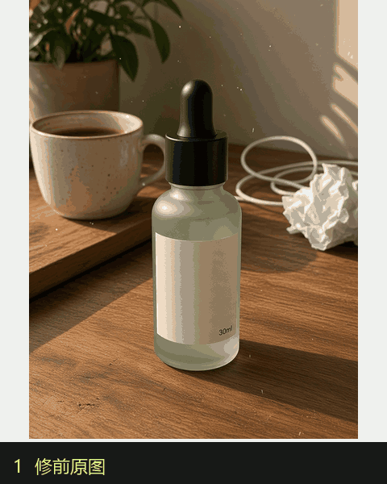
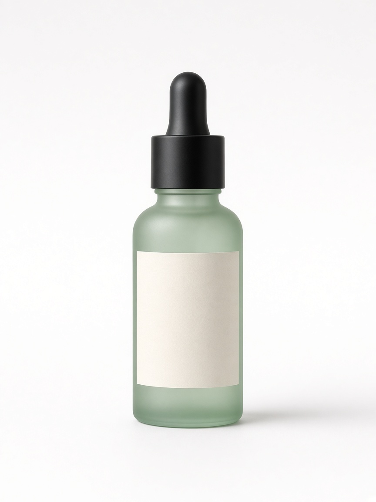
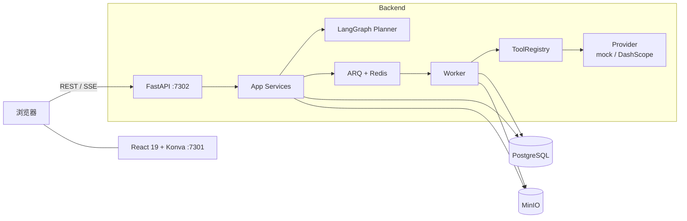

<p align="center">
  
</p>

<h1 align="center">AI 修图智能体</h1>

<p align="center">
  <b>一句话，交付可上架的商品物料。</b><br />
  输入需求或上传商品图，Agent 自动规划步骤、调用工具完成抠图、换背景、局部精修与多尺寸导出。
</p>

<p align="center">
  <a href="https://github.com/jiasongqi/ai-retouch-agent/stargazers"></a>
  
  
  
  
  
</p>

<p align="center">
  <a href="#快速开始">快速开始</a> ·
  <a href="#核心能力">核心能力</a> ·
  <a href="#架构">架构</a> ·
  <a href="#roadmap">Roadmap</a> ·
  <a href="#教学资料">教学资料</a>
</p>

<p align="center">
  
</p>

> 教学项目：[文字教程](docs/TUTORIAL.md) · [简历写法](docs/RESUME.md) · [面试题解](docs/INTERVIEW.md) · [答疑](docs/FAQ.md)

## 这是什么

面向电商运营和内容创作者的 **AI Agent 修图工作台**。不是聊天框里塞一张图，而是把自然语言、画布编辑器、图层系统和投放导出接到同一套工具注册表上：

- 你说「把这双鞋放到白底上，再出 1:1 和 9:16」
- Agent 拆成抠图 → 换背景 → 导出物料
- 每一步走 ARQ 队列，进度经 SSE 推到画布
- 计划可确认、单步重试或取消，人机协作而不是全自动黑盒

默认 `IMAGE_PROVIDER=mock`，**不配 API Key 也能把全流程跑通**。接 [阿里云百炼](https://bailian.console.aliyun.com/) 后切换为真实文生图 / 图像编辑 / 规划模型。

## 核心能力

| 能力 | 说明 |
| --- | --- |
| **一句话出图** | 提示词生成 4 张候选，四宫格挑选后进入编辑器，SSE 推送进度 |
| **自然语言修图** | LangGraph 规划步骤，26 个工具由 UI 和 Agent 共用同一份注册表 |
| **专业画布** | react-konva：缩放平移、图层文档、撤销重做、前后对比滑杆 |
| **智能选区** | SAM 点选 + 笔刷涂抹；首次算 embedding，后续只跑 decoder |
| **局部精修** | 选区内消除 / 替换，不外溢到其他区域 |
| **语义图层** | 主体 / 背景 / 文字分层，点选物体可提升为独立层并自动修背景 |
| **物料包交付** | 1:1、4:5、9:16 一次导出，主体不被裁切 |
| **影棚精修** | 接触阴影 + 倒影，写成可上架的棚拍主图 |
| **平台画幅** | 淘宝主图 / 亚马逊主图 / 抖音封面，按占比放入，不裁主体 |
| **场景库** | 大理石、原木、亚麻等 12 个固定场景，本地合成不调模型 |
| **Brand Kit** | 主色、安全边距、角标，套到平台导出和一键套图 |
| **一键套图** | 白底主图 + 场景图 + 卖点图 + 9:16 一次出齐 |
| **多步计划** | JSON 计划含依赖；服务端校验、补全、环检测、拓扑排序后执行 |

<details>
<summary>工具清单（26）</summary>

生成与增强：`generate_image` · `replace_background` · `expand_canvas` · `upscale_image`  
修图：`remove_background` · `adjust_image` · `erase_region` · `replace_region` · `apply_studio_finish`  
图层：`split_layers` · `promote_object_to_layer` · `set_layer_opacity` · `set_layer_visible` · `set_layer_text` · `reorder_layer`  
画布：`crop_canvas` · `flip_layer` · `scale_layer` · `rotate_layer` · `move_layer`  
投放：`generate_marketing` · `prepare_delivery_sizes` · `apply_scene` · `prepare_platform_export` · `export_listing_pack` · `batch_process`

</details>

<p align="center">
  
  
  
</p>

## 架构



一次修图请求：

```text
自然语言
  → LangGraph 规划 JSON 计划
  → 工具存在性 / 参数 / 依赖校验 + 拓扑排序
  → 用户确认（可单步重试 / 取消）
  → Worker 按依赖执行工具
  → Redis Pub/Sub + SSE 推进度
  → 画布更新图层与像素
```

## 技术栈

| 层 | 选型 |
| --- | --- |
| 前端 | React 19 · Vite 8 · Tailwind 4 · react-konva · TanStack Query |
| 后端 | Python 3.13 · FastAPI · SQLAlchemy 2 asyncio · Alembic |
| Agent | LangChain · LangGraph · 统一 ToolRegistry |
| 任务 | ARQ · Redis Pub/Sub · SSE |
| 存储 | PostgreSQL 17 · MinIO · JWT Cookie |
| 模型 | DashScope（文生图 / 图像编辑 / 规划）；本地 rembg · RapidOCR · SAM |
| 部署 | Docker 多阶段构建：前端打进后端镜像，同源托管 |

## 快速开始

跟着做一遍：[文字教程](docs/TUTORIAL.md)。下面是最短启动路径。

### 环境

- Docker >= 20（含 Compose）
- Python >= 3.13（仅开发模式需要）
- Node.js >= 20（仅开发模式需要）
- （可选）[阿里云百炼 API Key](https://bailian.console.aliyun.com/)

### 现在就能看落地页

开发服务器若已启动，打开 **http://127.0.0.1:7301/**（不要用 `localhost`，Windows 上可能走到 IPv6）。

`7302` 是 Docker 一键包（前端 + API 打进同一个容器）。没执行 `up.cmd` / `docker compose --profile full` 时这个端口是空的，浏览器会打不开。

### 一键体验（需要 Docker Desktop）

默认 `IMAGE_PROVIDER=mock`，不需要 API Key。本机需已安装并启动 [Docker Desktop](https://www.docker.com/products/docker-desktop/)。首次构建会下载模型，可能要几分钟。

```bash
git clone https://github.com/jiasongqi/ai-retouch-agent.git
cd ai-retouch-agent

# Windows
up.cmd

# macOS / Linux
chmod +x up.sh && ./up.sh
```

等价命令：

```bash
cp .env.example .env   # 已有可跳过
docker compose --profile full up -d --build
```

浏览器打开 **http://127.0.0.1:7302** （前端和 API 同源托管）。健康检查：<http://127.0.0.1:7302/api/health>。

只改前端、自己跑 Vite 时，继续用 **http://127.0.0.1:7301/**。

### 开发模式（不装 Docker 应用容器）

#### 1. 克隆

```bash
git clone https://github.com/jiasongqi/ai-retouch-agent.git
cd ai-retouch-agent
```

#### 2. 中间件

```bash
docker compose up -d
```

会拉起 PostgreSQL `:7311`、Redis `:7312`、MinIO `:7313`（控制台 `:7314`）。

#### 3. 后端

```bash
cd backend

# 安装 uv（已有可跳过）
# macOS / Linux
curl -LsSf https://astral.sh/uv/install.sh | sh
# Windows
# powershell -c "irm https://astral.sh/uv/install.ps1 | iex"

uv sync --all-extras          # 国内可加 --index-url https://pypi.tuna.tsinghua.edu.cn/simple

cp ../.env.example ../.env    # 默认 IMAGE_PROVIDER=mock，零费用跑通
# 接真实模型时：IMAGE_PROVIDER=dashscope，并填写 DASHSCOPE_API_KEY

uv run alembic upgrade head

# 终端一：API
uv run uvicorn app.main:app --reload --host 0.0.0.0 --port 7302

# 终端二：Worker
uv run arq app.worker.WorkerSettings
```

健康检查：<http://127.0.0.1:7302/api/health> ，三个字段都是 `ok` 即正常。接口文档：<http://127.0.0.1:7302/api/docs>。

#### 4. 前端

另开终端：

```bash
cd frontend
npm install                   # 国内可加 --registry=https://registry.npmmirror.com
npm run dev
```

浏览器打开 **http://127.0.0.1:7301/**（开发服务器绑的是 IPv4 回环；Windows 上 `localhost` 有时会走到 IPv6 连不上）。

### 测试

```bash
cd backend
uv run pytest
```

测试走 mock，不消耗模型额度。图像质量回归：

```bash
uv run python -m app.eval
```

落地页 Playwright（不依赖后端）：

```bash
cd frontend
npx playwright install chromium
npm run test:e2e
```

后端已启动时跑登录 → 出图 → 修图 → 导出：

```bash
npm run test:e2e:full
```

### 生产部署

前端构建产物打进后端镜像，同源托管。安全组放开 `7302`、`7313`：

```bash
cp .env.example .env
# 生产必改：JWT_SECRET（openssl rand -hex 32）
#           S3_PUBLIC_ENDPOINT=http://你的公网IP:7313

docker compose --profile deploy up -d --build
```

打开 `http://你的公网IP:7302`。

## 目录结构

```text
ai-retouch-agent/
├── frontend/                 # React 工作台 + 落地页
│   ├── e2e/                  # Playwright：落地页 / 工作台主路径
│   ├── public/landing/       # 商品修前修后与 Demo 素材
│   └── src/
│       ├── pages/            # 落地 / 创作 / 编辑器 / 导出 / 批量
│       ├── components/       # 画布、图层、Agent 对话、落地页
│       └── api/              # REST + SSE
├── backend/
│   └── app/
│       ├── agent/            # LangGraph 规划与计划校验
│       ├── listing/          # 平台画幅、场景库、Brand Kit、一键套图
│       ├── tools/            # 26 个工具，一处注册同时服务 UI / Agent
│       ├── services/         # 会话、资产、导出、批量
│       ├── edits/            # 像素、选区、拆层、OCR、SAM
│       ├── providers/        # mock / DashScope
│       ├── tasks/            # ARQ Worker
│       └── eval/             # 抠图 IoU、调色 PSNR 等回归
├── docs/                     # 文字教程 / 简历写法 / 面试题解 / 答疑
├── docker-compose.yml
├── Dockerfile
├── up.cmd / up.sh            # 一键拉起 API + Worker + 前端
```

## 配置

关键项在仓库根目录 `.env.example`：

| 变量 | 含义 |
| --- | --- |
| `IMAGE_PROVIDER` | `mock` 本地占位图 / `dashscope` 真实模型 |
| `DASHSCOPE_API_KEY` | 百炼密钥，仅真实模型需要 |
| `PLANNER_MODEL` | Agent 规划模型，默认 `qwen-plus` |
| `MATTING_PROVIDER` | `auto` 优先 rembg，`corner` 四角抠图 |
| `OCR_PROVIDER` | `auto` 有 RapidOCR 则拆文字层 |
| `JWT_SECRET` | 生产必须替换 |

## Roadmap

- [x] 落地页：工作台式前后对比 + 投放物料灯箱 + 短 CTA
- [x] Hero 换成真实商品修前 / 修后
- [x] README / 首页嵌入编排演示（GIF + 可点分镜）
- [x] 本地一键：`docker compose --profile full` 同时拉起 API、Worker 和前端
- [x] Playwright：落地页必跑；工作台主路径在后端可用时跑
- [x] 场景提示词模板（白底主图 / 场景图 / 9:16 / 海报）一键填入
- [x] 影棚精修：接触阴影 + 倒影
- [x] 平台导出预设：淘宝主图 / 亚马逊主图 / 抖音封面
- [x] Brand Kit：主色、安全边距、角标
- [x] 可视化场景库（12 个固定场景，本地合成）
- [x] 一键套图：白底 + 场景 + 卖点 + 9:16
- [ ] 扩大 `app.eval` 数据集（换背景、局部替换、多层导出）
- [ ] 英文 README，方便 GitHub 检索
- [ ] 作品只读分享链接

欢迎提 Issue / PR。扩展思路也可以直接写进简历里的「个人贡献」。

## 你能学到什么

选题跟的是 AI Agent + AIGC，不是增删改查。一条链路里同时有：

- FastAPI + SQLAlchemy + JWT Cookie
- Provider 抽象：一行配置切换 mock / 真模型
- ARQ + Redis Pub/Sub + SSE 实时进度
- react-konva 图层文档与视口
- LangChain 接模型、LangGraph 编排计划
- 统一工具注册表
- SAM 点选、语义拆层、计划校验与拓扑排序
- Docker 多阶段构建与 compose profile

## 教学资料

本仓库文档：

| 文档 | 内容 |
| --- | --- |
| [文字教程](docs/TUTORIAL.md) | 从启动到出一套上架图，再顺着代码走一遍请求链路 |
| [简历写法](docs/RESUME.md) | 项目一句话、STAR 示例、可写的个人贡献 |
| [面试题解](docs/INTERVIEW.md) | Agent 规划、工具注册表、SSE、计划校验等高频问答 |
| [答疑](docs/FAQ.md) | 端口打不开、mock / 真模型、密钥、部署常见问题 |

## Star History

[](https://www.star-history.com/#jiasongqi/ai-retouch-agent&Date)
